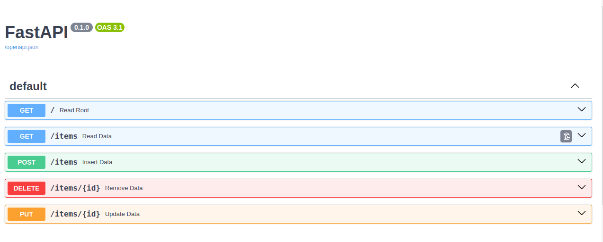

# Assignment5-FastAPI Docker

# Description :
We design a application base on Fastapi and Docker with Sql Server as a database and uploaded on Liara.
<br>

# How to install :
```
pip install -r requirements.txt
```
# How to Run :
```
https://ghaffari.liara.run/items

```
liara's docs :




# API Guide

1) GET API: https://ghaffari.liara.run/items

    This url get all data.

2) POST API: https://ghaffari.liara.run/items

    This url with a body contains data, will insert new record.

    body could contains: title, description, time, status.

3) DELETE API: https://ghaffari.liara.run/items/{id}  

    This url delete one record with declared id.

4) PUT API: https://ghaffari.liara.run/items/{id}   

    This url with a body contains data, will update existing record.

    body could contains: title, description, time, status.


