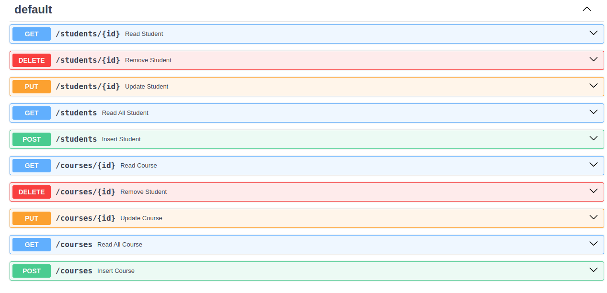

# FastAPI - Docker - SQLALCHEMY

# Description : 

FastAPI works with any database and any style of library to talk to the database.A common pattern is to use an "ORM": an "object-relational mapping" library.
Common ORMs are for example: Django-ORM (part of the Django framework), SQLAlchemy ORM (part of SQLAlchemy, independent of framework) and Peewee (independent of framework), among others.
in this priject we use SQLAlchemy.

# How to run :
+ ## Beginner mode : 
```
uvicorn main:app --reload
```
then open ``` http://127.0.0.1:8000/docs ``` in your browser and test all of it's methods .

+ ## Expert mode :

+ 1- docker pull sqlserver
```
docker pull mcr.microsoft.com/mssql/server
```
+ 2- docker run :
```
docker build -t mehdi .
```
+ 3_ test in local system : ``` uvicorn main:app --reload ```


+ ## Deploy-liara :

+ 1- upload database in liara : 
<br> first we create a [sql server 2019 database](https://console.liara.ir/databases/create) 

SQLALCHEMY_DATABASE_URL  =  "Data Source=mssql,1433;Initial Catalog=myDB;User Id=sa;Password=*;"

+ 2- upload docker in liara and project is available in  : https://ghaffari.liara.run/docs
<br> :



